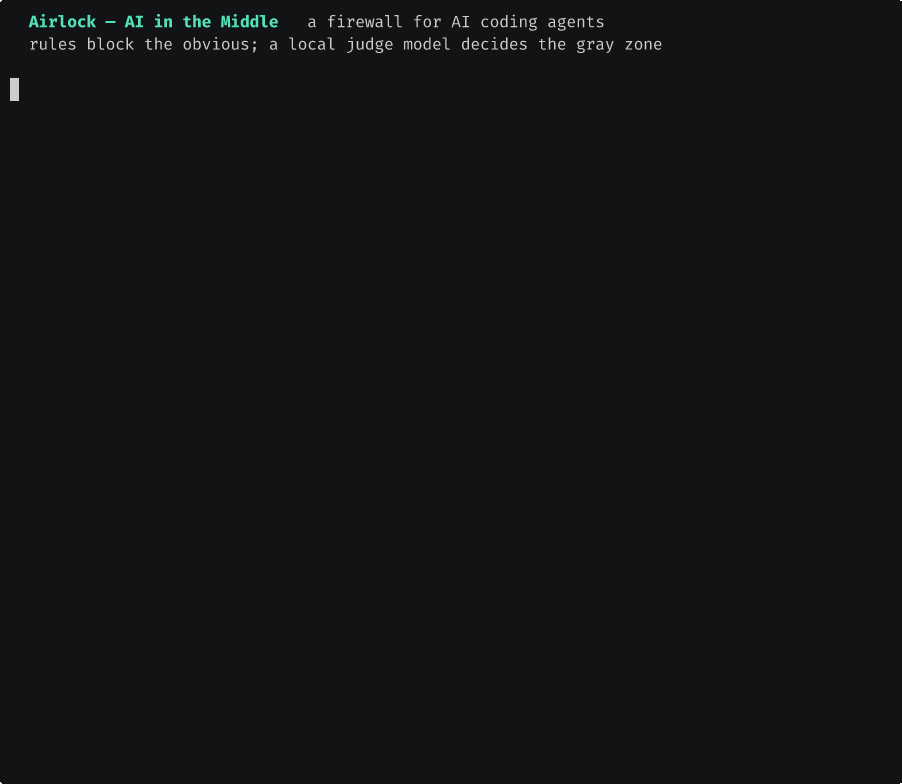

# Airlock, a runtime firewall for AI coding agents

[](https://pypi.org/project/airlock-agent/)
[](https://github.com/cyberbobas/airlock/actions/workflows/tests.yml)
[](https://pypi.org/project/airlock-agent/)
[](LICENSE)

Gate every tool call, MCP call and skill your agent runs against a
least-privilege policy. Static scanners check a skill once, before install.
Airlock sits in the call path and decides **this call, right now**. That is
where a skill that reads clean and behaves badly actually gets stopped.

Deterministic rules block the unambiguous — secret paths, `rm -rf /`, exfil
collectors, cloud-metadata SSRF, log erasure — with zero latency. For the **gray
zone** an optional **built-in judge** (a small model we fine-tuned and ship as a
single offline `llamafile`) tightens the call `ask → block` with a one-line
reason. It only ever tightens, never loosens, and fails safe: if it is slow or
unsure, the rules stand. Run several agents behind one gate and **`airlock
monitor`** shows, live, which agent got blocked for what.

Part of [Agentoffense](https://agentoffense.com/solutions/airlock_ai/).

> **New:** **AI in the Middle** — a local, offline judge model
> ([`airlock ai-tier standard`](#the-built-in-judge--ai-in-the-middle)) that
> decides the gray zone, tighten-only and fail-safe · a live
> [`airlock monitor`](#watching-your-agents--airlock-monitor) dashboard with
> **per-agent attribution** · and [`airlock
> breach`](#if-it-already-happened-airlock-breach) for post-incident
> reconstruction. See the [CHANGELOG](CHANGELOG.md).



<sub>The built-in judge tightens a gray-zone `chmod -R 777` to **block**, the attacker toolkit is hard-blocked by the rules, and `airlock analyze` flags the window as suspicious — all local, all offline.</sub>

```
 agent ──native tools──▶ [PreToolUse hook] ─┐
                                            ├─▶ rules ─▶ allow / ask / block
 agent ──MCP stdio──▶ [airlock-mcp] ──▶ server ─┘     │        │
                                                      │   gray zone (ask)
                                                      │        ▼
                                                      │   [AI judge] ─ tighten ─▶ block
                                                      ▼
                                          audit.jsonl (hash-chained, signable,
                                                       per-agent attribution)
```

## Install

**One command:**

```bash
# Linux / macOS
curl -fsSL https://raw.githubusercontent.com/cyberbobas/airlock/main/install.sh | sh
```
```powershell
# Windows (PowerShell)
irm https://raw.githubusercontent.com/cyberbobas/airlock/main/install.ps1 | iex
```

**Or with your own package manager:**

```bash
pipx install airlock-agent      # or: uv tool install airlock-agent / pip install airlock-agent
brew tap cyberbobas/tap && brew install airlock   # macOS
```

Then:

```bash
airlock demo                    # watch it stop a key-theft (nothing of yours touched)
airlock init                    # wire the hook, wrap every agent's MCP servers
airlock doctor                  # confirm what is actually enforcing
```

`airlock init` backs up every file it edits and marks every line it adds.
`airlock uninstall` removes exactly those lines and restores the original file
**byte-for-byte**, formatting included — it writes back the backup rather than
re-serialising, so nothing shows up in your git diff. If you edited the file
after installing, your edits win and it falls back to a semantic unwrap.
`--purge` also deletes Airlock's own data.

`airlock init` never prompts — it applies its changes and prints exactly what it
touched. `airlock uninstall` asks for confirmation first; pass `-y` to skip the
prompt when running non-interactively.

Requires Python 3.11+. Linux, macOS and Windows — the gate (hook + MCP proxy),
`init`/`uninstall`, `scan`, `check`, `demo`, `doctor`, `policy propose` and
`monitor` run on all three (Windows core is CI-tested). The interactive approval
daemon and desktop toasts are POSIX-only; on Windows an `ask` uses the policy's
fallback (run under WSL for the full experience). One dependency (PyYAML).

**See it work in one command** — no setup, no config, nothing of yours touched:

```bash
airlock demo    # a poisoned skill tries to steal your SSH key; watch it get refused
```

<details>
<summary><strong>Verified end to end</strong> — clean venv → install → init → doctor → demo → uninstall</summary>

Run on 2026-08-23, Python 3.13, Linux, in a throwaway `$HOME`:

```console
$ python3 -m venv venv && . venv/bin/activate
$ pip install ".[sign]"
Successfully installed airlock-agent-0.4.6 …

$ airlock init --profile default
  ✓ policy written from profile 'default'
  ✓ PreToolUse + PostToolUse hooks -> …/bin/airlock-hook
  ✓ wrapped 1 MCP server            (backup written alongside)

$ airlock doctor                    # exit 0
  ✓ policy loads: 100 rules, mode=guard
  ✓ audit: chain intact across 2 records
  ✓ Claude Code PreToolUse hook is wired
  ✓ all MCP servers in 1 config(s) are gated

$ ./demo.sh
  … poisoned server HELD, every call BLOCKed, CHAIN INTACT across 21 records

$ airlock uninstall -y
  ✓ removed 2 Airlock hook entries
  ✓ unwrapped 1 MCP server (restored the original file byte-for-byte)
```

`uninstall` left the project's `.mcp.json` byte-for-byte identical to before
`init`.
</details>

## The first five minutes

```bash
airlock init --profile default   # block the dangerous, stay out of the way
# ... work normally for a while ...
airlock allow recent             # what got in your way, most frequent first
airlock allow last               # permit it, narrowly, in one command
airlock report                   # what the week looked like
```

## Let Airlock write your policy

The usual objection to any firewall is "it'll get in my way." So don't guess the
rules — watch, then derive them. Run a week in `yolo` (logs, blocks nothing),
then ask Airlock for the least-privilege policy that covers what your agents
*actually* did:

```bash
airlock profile yolo             # week one: learn, block nothing
# ... work normally ...
airlock policy propose           # print the tightest allows that cover the week
airlock policy propose --apply   # ...or write them straight into your policy
airlock profile default          # now guard
```

`propose` reads the audit log and collapses what it saw into narrow grants — one
directory glob instead of forty files, one host per egress tool. It only ever
proposes *allows*, and only for calls that were allowed and carried no
high-severity flag: anything blocked, asked about, or flagged for reaching a
secret or a collector is reported for you to see, never silently whitelisted.
`--apply` **holds back bare shell-tool grants** — a blanket "allow the shell" is
too broad to write unattended — and tells you to review them; pass
`--include-shell` to write those too.

Prefer to watch it live? `airlock monitor` is a full-screen board of decisions as
they happen — allow, ask, block, hold — so the gate is something you can see
working, not a black box.

## Profiles — pick a posture, don't read YAML

| profile | explicit `block` rules | call no rule matched | `ask` with no human | for |
|---|---|---|---|---|
| `yolo` | logged, **not** blocked | allowed | allowed | week one: learn what your agents do |
| `default` | **blocked** | allowed + logged | allowed + logged | day-to-day |
| `paranoid` | **blocked** | asks a human | **refused** | a production repo, a regulated codebase |

```bash
airlock profile                 # which one is active, and why
airlock profile paranoid        # switch (keeps an existing edited policy)
airlock profile paranoid --force # overwrite your policy with a fresh profile
```

Switching profiles will **not** overwrite a policy you already have — your edits
and `grants:` win, so `airlock profile paranoid` on an existing policy reports
that it kept your file. Pass `--force` to replace it with a clean copy of the
profile.

The intended path is `yolo` → `default` → `paranoid`: learn, then guard, then
tighten. A firewall that gets in the way on day one is the one that gets
uninstalled, so `default` blocks only what is unambiguously dangerous.

## When something is blocked

You get a desktop notification saying what and why, the agent gets a refusal it
can read, and one command fixes it:

```bash
airlock allow last                        # grant the thing you were just stopped on
airlock allow last --expires 2026-12-31   # ...until a date
airlock allow notes read_note --match '/data/*'
airlock allow list                        # what you have granted
airlock allow revoke 2
```

`allow last` folds together every time the same call was gated and proposes the
tightest grant that covers them — usually one directory instead of twelve files.

**It won't nag you.** A prompt fatigue that gets a security tool uninstalled is
itself a failure mode, so asks are dampened three ways: `default` never asks on
an unmatched call (only explicit `ask` rules and `paranoid` do); an answer you
give is **remembered** and reused for `AIRLOCK_ASK_REMEMBER` seconds (default 5
minutes), so an agent retrying the same call does not re-prompt you; and `allow`
turns a recurring question into a one-line standing grant. `airlock report` shows
how many times you were actually interrupted, and how many repeats a remembered
answer silenced. Absolute blocks and scan escalations are decided before an ask
is ever raised, so remembering an answer can never resurrect something forbidden.

Block notifications are capped the same way: the same block won't re-toast within
a cooldown, and a burst of *different* blocks past `AIRLOCK_NOTIFY_MAX` folds into
a single "N more blocked — `airlock report`" summary instead of a wall of toasts.

**A grant can never lift an absolute block.** Secret paths, `rm -rf /`, cloud
metadata, known exfil collectors and download-and-execute are checked *before*
grants, against every argument. `airlock allow` will tell you it refused rather
than write a grant that quietly does nothing.

## The built-in judge — "AI in the Middle"

Deterministic rules settle the unambiguous. What is left is the **gray zone** —
the calls a rule marks `ask`. Airlock ships an optional local model that decides
that gray zone: it sees ONE call the rules could not settle and returns a
one-line verdict with a human reason.

```bash
airlock ai-tier standard     # download/enable the built-in judge (one llamafile)
airlock ai-status            # tier / model / backend
```

Three tiers: **lite** (rules only, no model), **standard** (the built-in judge,
recommended), **pro** (bring your own local or cloud model — off by default,
can be hard-locked off by policy). The model is a fine-tuned **Qwen2.5-3B**
shipped as a single self-contained `llamafile` — **100% offline**, no install,
no key, nothing leaves the machine.

Two properties make it safe to put a model in the call path:

* **Tighten-only.** The judge may turn `ask → block`. It may **not** turn a
  should-block call into allow — an absolute block is decided by the rules
  *before* the judge ever runs. So the worst a bad model can do is ask you about
  something it could have allowed, never allow something it should have blocked.
* **Fail-safe.** Slow, unreachable or off-task ⇒ the judge gives no opinion and
  the rules stand (audited as `judge_noop`, never silent). It is
  defense-in-depth, not the boundary.

Live, on the shipped model: a gray-zone `chmod -R 777 /var/www` (rules: `ask`)
comes back **`block` — "state-changing command needs review"**, while
`npm install left-pad` is left alone. The judge is a `-seed` model trained on a
bootstrap corpus; the tighten-only invariant is what makes that safe to ship.

## allow / block / ask — and your agent's permission mode

Every call ends as one of three, and the difference matters when you run more
than one agent:

* **block** — Airlock stops the call itself. Absolute blocks (secrets, exfil
  collectors, `rm -rf /`, cloud metadata, curl-pipe-shell) fire **regardless of
  what the agent is set to** — the agent never gets to run it.
* **allow** — the call goes through.
* **ask** — Airlock flags the call as one a human should approve. In the
  **hook** path (an agent's native tools) Airlock hands that flag to the agent's
  *own* permission prompt and records `ask`. So **whether you actually get asked
  is the agent's decision, not Airlock's.** If the agent runs in an
  auto-approve mode — grok's `permission_mode = "always-approve"`, Claude Code's
  `bypassPermissions`, `--dangerously-skip-permissions`, etc. — it approves the
  `ask` itself and you are never prompted. Claude Code in its default mode shows
  *you* the prompt.

The takeaway: **an auto-approving agent silences `ask`, but never an absolute
block.** If you want Airlock to hard-stop the gray zone too (not defer it to the
agent), raise the posture so an `ask` becomes a refusal when no human answers:

```bash
airlock profile paranoid           # ask on far more, refuse an unanswered ask
# or keep default but fail an unattended ask closed:
export AIRLOCK_UNATTENDED=block    # (or set `unattended: block` in the policy)
```

## Watching your agents — `airlock monitor`

`airlock log` is the rear-view mirror; **`airlock monitor`** is the windscreen: a
live, full-screen board that updates as decisions land. It shows the allow /
block / ask split, the **top block reasons** and **busiest tools** for the
session, and a live feed where every entry carries the command and, for a block,
the reason in red (`blocked: known exfil collector`). It draws on the alternate
screen (like `htop`), so it never litters your scrollback.

**One gate, several agents — who did what.** When you run more than one agent
behind Airlock, `airlock init` wires each one's hook stamped with its name
(`airlock-hook --agent claude` / `--agent grok` / `--agent cursor`), so every
decision is attributed to the agent that made it. The monitor then shows a
**BY AGENT** line — `claude ✗2/40   grok ✗31/54   cursor ✗5/38` (blocked/total)
— and an agent column per row, so at a glance you see *which* agent is reaching
for the things that get blocked. (The label is self-reported via `$AIRLOCK_AGENT`
and bound into the signed audit chain, so it cannot be rewritten after the fact.)

## Scheduled review — `airlock analyze` / `airlock watch`

The monitor is for watching live. For the times nobody is watching, **`airlock
analyze`** reviews the audit log over a window and flags what looks like trouble:

```bash
airlock analyze --window day          # review the last 24h, print a report
airlock analyze --window week --save  # ...and write it to ~/.airlock/reports/
airlock watch --install daily         # run it automatically (also 6h/weekly/monthly)
airlock watch --status                # show the schedule
```

Two layers, same fail-safe posture as the rest of Airlock:

* **Deterministic signals** (always, no model): every block is classified —
  secret read, exfiltration, reverse shell, log/audit erasure, cloud-metadata
  SSRF, destructive, gate-tamper — plus per-agent block rates, a target hit
  again and again (persistence), block bursts, rug-pull toolset holds, and
  high-severity scan flags. The window is graded **clean / notable /
  suspicious**, and `analyze` exits non-zero on *suspicious* so a cron or CI
  wrapper can alert on it.
* **An AI verdict on top** (standard/pro): the built-in micro-brain — or a
  bring-your-own big model (Claude, etc.) — reads the same facts and writes an
  analyst narrative pointing at the suspicious activity. If it is slow or absent
  the deterministic report stands.

`airlock watch --install` writes a single marked block into your user crontab
(and removes exactly that block on `--uninstall`, never a line you wrote). On a
box without cron, `airlock watch --every 6h` runs the same thing as a foreground
loop. Every review is saved as Markdown under `~/.airlock/reports/` and recorded
in the audit log, so you get a durable trail of "what did my agents do while I
was away, and was any of it worth a look."

## What is actually covered

Being precise about this matters more than the feature list, because a mixed
fleet is the normal case.

| surface | covered | how |
|---|---|---|
| **Any MCP server, any agent** (stdio) | ✅ | `airlock-mcp` proxy — vendor-neutral, this is the broad one |
| Claude Code native tools | ✅ | PreToolUse hook decides; PostToolUse records what ran |
| grok native tools | ✅ | PreToolUse hook in its `config.toml` (Claude-compatible), stamped `--agent grok` |
| Cursor native tools | ✅ | PreToolUse hook in `~/.cursor/hooks.json`, stamped `--agent cursor` |
| Windsurf / Cline / Codex native tools | ❌ | their MCP servers are gated; their *built-in* file and shell tools are not (no PreToolUse hook) |
| MCP over HTTP/SSE | ❌ | stdio only today |
| A process opening its own socket | ❌ | needs an OS-level egress shim (plane ③) |
| A shell command launching an MCP server directly | ⚠️ | blocked by a policy rule, not by the OS — see Limits |

If your team is on mixed agents: every agent's **MCP** traffic is gated the same
way. Only Claude Code's own built-in tools currently get the second gate. We
would rather say that than have you find out during a rollout.

`airlock init` finds the MCP servers each agent actually runs. Not just a
project `.mcp.json`, but Cursor, Windsurf, Cline, Claude Desktop and Kimi CLI
(standard `mcpServers` JSON), **grok** (its `[mcp_servers]` TOML), **mimo** (its
`mcp` JSON) and **DeepSeek Harness** (its `dsh-mcp-client` entries in cordis
profile YAML). The last three are verified against the installed CLIs, which read
the wrapped config and launch each server through the gate. For every agent
except Claude Code this gates the **MCP calls**, not the agent's own built-in
file and shell tools (only Claude Code has the second gate, its PreToolUse hook).
It deliberately leaves Claude Code's live
`~/.claude.json` alone: those MCP calls already go through the PreToolUse hook
(same policy, holds and contracts), so wrapping them would only double-gate a
file Claude Code rewrites out from under us. `airlock doctor` lists any server
still ungated, named by store, and `airlock doctor --fix` wraps the stragglers
(and wires the hook if it is missing) in one command:

**Any agent, even one Airlock doesn't know.** Point it at any config that is a
standard `mcpServers` file and it gets gated (and cleanly unwrapped) like a
built-in store — no code change needed:

```bash
airlock init --mcp-config ~/.some-agent/mcp.json   # one-off, repeatable
export AIRLOCK_MCP_CONFIGS=~/.some-agent/mcp.json   # durable across init/doctor/uninstall
```

```bash
airlock doctor        # ! MCP servers not behind Airlock: notion [Cursor], … 
airlock doctor --fix  # wrap them, then re-check
```

## Fail-closed, on purpose

This is a security property, not an implementation detail:

* If the **policy will not load**, the hook exits 2 (block) and the proxy
  refuses to start. No policy means no boundary, so it does not run without one.
  `AIRLOCK_FAIL_OPEN=1` inverts this, knowingly.
* If the **gate itself throws**, the proxy answers with a refusal rather than
  forwarding. An exception in the firewall is not an open door.
* If a **toolset changes** after it was pinned, every call to that server is
  held until a human approves — detection that auto-accepts is not a control.
* If an **`ask` cannot reach anyone**, `paranoid` refuses and `default` allows
  and says so in the report. Which of those you want is a profile choice, made
  explicitly, not a silent default.

## Overhead — measured, not assumed

```
policy decision      p50    25 µs    p99   357 µs
MCP call, direct     p50  0.068 ms   p99  0.091 ms
MCP call, gated      p50  0.556 ms   p99  0.739 ms
added by Airlock     p50  0.489 ms   p99  0.649 ms
peak RSS             27 MB
```

Sustained: 50 000 gated calls at ~1 200/s across 45 log rotations, with memory
flat to within 32 KB and no descriptor growth. Python 3.14, Linux; also verified on 3.13. Reproduce with
`airlock bench`. For scale: one model turn is
hundreds of milliseconds at best. The gate is not where your agent spends time.

Those are the proxy's numbers, measured in-process. The Claude Code hook is a
separate process per call, so it costs what starting Python costs — about 75 ms,
nearly all of it interpreter startup rather than anything Airlock does.

Audit durability is tunable: `AIRLOCK_AUDIT_FSYNC=critical` (default) fsyncs
blocks and asks but not the routine allow flood; `always` for compliance.

## Scan before you install

```bash
airlock scan ~/.claude/skills          # a folder of SKILL.md
airlock scan ~/.claude/settings.json   # MCP server defs AND hook commands
airlock scan ./skill --json            # machine-readable
airlock scan ./skill --fail-on-findings # exit 1 in CI
```

Reads what an agent reads as instructions — `SKILL.md` and `AGENTS.md`, but
also `.claude/commands/`, `.claude/agents/`, `.cursor/rules/`,
`.github/copilot-instructions.md`, and any file whose frontmatter makes it a
skill wherever it sits. Reports injection / secret-access / exfil / stealth
indicators with line numbers, enumerates every MCP server definition, says
which are **not** behind Airlock, and gives each its admission state. Indicators are evidence for a human, never a verdict.

The score is weighted by *where* a finding sits. An imperative in a `SKILL.md`
is evidence; the same words in source, in a test, or in prose about these
attacks are usually not. The top of the scale needs intent — text that
overrides instructions or hides itself — or a credential named together with
somewhere to send it. Everything found is still listed either way; only the
number changes.

Each MCP server in the report also carries what the runtime gate makes of it:
pinned, never seen, or held.

**In CI, as a GitHub Action.** Scan every pull request before a poisoned skill or
MCP definition can merge:

```yaml
# .github/workflows/airlock.yml
jobs:
  scan:
    runs-on: ubuntu-latest
    steps:
      - uses: actions/checkout@v4
      - uses: cyberbobas/airlock@v1
        with:
          paths: ".claude .mcp.json .cursor AGENTS.md"
          fail-on-findings: true
```

The action is in [`action.yml`](action.yml); a copyable workflow is in
[`docs/scan-action-example.yml`](docs/scan-action-example.yml).

Airlock does **not** scan tool *output* to decide anything. Measured on ordinary
content, these indicators fire constantly and legitimately: this project's own
README, threat model and profiles each trip several high-severity ones. A gate
that refused results on that basis would be unusable, and one that asked about
them would be worse.

## Indicators that stay current

Collector hosts and injection phrasings rot like antivirus signatures, so
indicators can be refreshed from a versioned feed that updates independently of
the code.

> **No hosted feed is published yet.** Airlock ships a bundled indicator floor
> and works fully without an update. Until a signed public feed is online,
> `airlock update` is only useful against a feed you point it at — a URL or file
> you host and sign yourself. Everything below describes that mechanism.

```bash
airlock update --status              # what is active, and what it sits on top of
airlock update ./feed.json           # install a feed you host (must be signed)
airlock update https://you/feed.json # …or fetch one over HTTPS
```

**Unsigned feeds are refused.** A tool that exists because people install code
they have not read does not get to fetch its own detection rules over plain
HTTPS and trust the answer. Set `AIRLOCK_FEED_KEY` to the feed's key, or pass
`--allow-unsigned` for a feed you host yourself.

**The bundled indicators are a floor.** An update is merged *on top of* both
`scan.py`'s patterns and the `data/feed.json` that shipped in the wheel. It can
add indicators and raise a severity — it cannot delete one or lower a severity.
So a poisoned feed can make Airlock noisy; it cannot make it blind. (This was
only half true before an audit: half the indicators live in the bundled feed,
and an update that redefined them switched those detections off.)

**A feed cannot make Airlock stall either.** Patterns run in-process on every
gated call and Python's `re` cannot be interrupted, so `(a+)+$` in a feed meant
a call that never got an answer and an agent that hung — worse than a wrong
verdict. A pattern is now refused at install time if it nests an unbounded
quantifier, or if timed probes in a killable child process do not finish.

## Rug pull: detected *and* held

```
$ airlock pins
  repo-tools  [HELD]
    hash    7bf9f6f2f032ca70…
    pending a91c4e0b22d7f118…  seen 2026-08-21T09:12:44Z
      + run_command
      airlock pins approve repo-tools
```

While a server is held **every call it receives is blocked**, including ones the
policy would allow.

The same hold catches poisoning on *first* sight, not just drift. If a tool
description carries an injection or exfiltration indicator, the toolset is
pinned and held rather than admitted — the scanner used to record three
high-severity findings and then let the calls through unchanged, which is
detection that narrows nothing. Reviewed and legitimate? `airlock pins approve`.
`yolo`, which escalates nothing, does not hold. Real servers do not trip it:
`mcp-server-git` (12 tools) and `mcp-server-fetch` admit clean.

## Per-skill contracts

Global policy answers "may *any* skill do X?". A contract answers "may *this*
skill do X?".

```bash
AIRLOCK_MODE=observe   # ... run for a while: records each server's real footprint
airlock contracts list
airlock contracts promote notes   # turn what was observed into an enforced grant
```

```yaml
notes:
  enforced: true
  tools: [read_note]
  fs:   ["*/notes/*"]
  net:  []
  shell: false
  default: block
```

Every string in the argument object is classified — not just the primary one —
so the target cannot be hidden in a second argument.

## Evidence

```bash
airlock log -n 40                 # recent decisions with their concrete targets
airlock verify                    # exit 0 intact · 1 broken · 2 tail unprovable
airlock export --format cef       # into ArcSight / Splunk
airlock export --format syslog    # RFC5424
airlock report --markdown         # the page you send your manager
```

Every record carries `prev` + `h`, and every write updates a tail checkpoint.
Editing or deleting any past line breaks every digest after it; removing records
from the *end* — where someone covering their tracks would cut — no longer
verifies as intact. The chain **continues across rotations** — a new segment
starts from the previous one's last digest — and every rotation is written to
`audit.chain`, so deleting or truncating a whole segment is reported too:

```
$ airlock verify
  CHAIN BROKEN  audit segment audit-20260820081301837476.jsonl is missing
                — 2026-08-20T08:13:01Z rotation was deleted
```

The ledger is not a soft spot: it is itself a hash chain, signed alongside the
records when signing is on, and each handover is **anchored** by a record in the
new segment naming that ledger entry. Removing a ledger line therefore
contradicts the log, and editing the log to agree breaks the record chain:

```
$ airlock verify           # after deleting a segment *and* its ledger line
  CHAIN BROKEN  the audit log records a rotation to audit-…jsonl that the
                rotation ledger no longer lists (entry 03c16ffb6005e035)
                — audit.chain was truncated, pruned or deleted
```

That is tamper *evidence*.

The log also records the gate itself. Each enforcement point fingerprints the
policy it loaded, its digest, the mode and any `AIRLOCK_*` variable that can
weaken it, and writes one line whenever that changes — so a run under a
substituted policy is visible as a substitution rather than as a quiet stretch
of ordinary-looking allows. `airlock report` leads with the count when it is
not zero. It is not tamper-proofing: an attacker holding the
HMAC key can re-forge both structures. What raises that ceiling is shipping the
log off the box, or `AIRLOCK_SIGN=ed25519` with the private key held elsewhere.

For attribution, enable signing:

```bash
AIRLOCK_SIGN=hmac       # local key at $AIRLOCK_HOME/audit.key
AIRLOCK_SIGN=ed25519    # AIRLOCK_SIGN_KEY -> a key the agent cannot read
```

HMAC with a local key protects a log once it leaves the machine, not against a
process running as you. Ed25519 with the private key held elsewhere is the real
answer; we say so rather than calling the cheap one "signed audit".

## If it already happened: `airlock breach`

Prevention is one half. The question that lands *after* an incident — or after
a headline about a new tool-poisoning class — is **what did the agent already
touch, did any of it leave the machine, and which exact credentials do I rotate
this minute?** `airlock breach` reconstructs that from the audit log you already
have. It is read-only, like `verify` — forensics must not write to the scene.

```bash
airlock breach --simulate          # see it on a canonical incident, no log needed
airlock breach --since 2d          # the last two days
airlock breach --session 9f3a…     # one agent session
airlock breach --markdown > ir.md  # a report for a manager or an insurer
```

It opens with an integrity banner (`verify` across every segment), so the report
proves the log it reasoned over was not edited or truncated — reconstruction
*plus* proven source integrity, which a transcript scraper cannot offer. Then a
kill-chain timeline, a **rotate** list, and a checklist.

It grades evidence instead of shouting verdicts. `CONFIRMED` is reserved for the
one signal that is not a guess — the secret's own payload digest reappearing in
the outbound call. A hit on a known exfil collector proves exfiltration
*happened* but not that it carried *this* secret, so it is `PROBABLE`; a read
with no correlated egress is `POSSIBLE`. A clean window says so in one line and
rotates nothing. Exit codes suit an IR script: `0` clean, `1` burns found, `2`
the log itself cannot be trusted.

Coverage is stated every time: it sees what the gate saw. Native tools of
non-hooked agents, MCP started outside the proxy and direct process sockets are
not covered, and the report says a missing event is not proof one did not occur.

## Per-project policy

A repository may ship `.airlock/policy.yaml` (or `.airlock.yaml`), found by
walking up to the repo root. It is an **overlay that can only tighten**: every
decision is taken against your policy *and* the project's, and the stricter one
wins. Its `mode`, `default` and `ask_fallback` can only get stricter, and its
`grants:` are ignored outright.

That asymmetry is the whole point. A project policy that could win outright
meant `git clone` was a way to switch the firewall off — four lines in a dotfile
nobody reads (`default: allow`, `rules: []`) and `rm -rf /` was allowed on a
machine running the paranoid profile. Working on code nobody has read is the
situation Airlock exists for; that code does not get a vote on its own gate.

Your own policy is found in this order:

1. `AIRLOCK_POLICY` (an explicit choice — it takes no overlay)
2. `$AIRLOCK_HOME/policy.yaml` (yours, written by `airlock init`)
3. the bundled profile

`airlock doctor` names both files and says which is the overlay. Paths use
`${workspace}`, `${home}`, `${user}`, `${tmp}` — no absolute paths in a shared
file.

## Commands

| | |
|---|---|
| `init` · `uninstall` · `profile` · `policy propose` · `doctor` | setup |
| `allow` · `check` · `log` · `monitor` · `report` | daily |
| `scan` · `pins` · `contracts` · `update` | admission |
| `verify` · `export` · `breach` | evidence |
| `bench` · `demo` | overhead / try it |
| `mcp` · `hook` · `askd` | runtime |

## Config

* `AIRLOCK_MODE=observe|guard|enforce` — override the profile's posture.
* `AIRLOCK_POLICY`, `AIRLOCK_HOME`, `AIRLOCK_WORKSPACE`, `AIRLOCK_PROFILE`
* `AIRLOCK_ASK_BACKEND=socket,osascript,zenity,tty,fallback`
* `AIRLOCK_ASK_TIMEOUT=60` · `AIRLOCK_ASK_TTY=1`
* `AIRLOCK_ASK_REMEMBER=300` — seconds an answered `ask` is reused before the
  same question prompts again (0 to always re-ask).
* `AIRLOCK_NOTIFY=0` — no desktop notification on block.
* `AIRLOCK_NOTIFY_COOLDOWN=20` — seconds before the *same* block notifies again.
* `AIRLOCK_NOTIFY_MAX=5` · `AIRLOCK_NOTIFY_WINDOW=60` — at most this many block
  toasts per window; a burst of *different* blocks past that folds into one
  "N more blocked" summary (0 disables the cap).
* `AIRLOCK_FAIL_OPEN=1` · `AIRLOCK_STRICT=1`
* `AIRLOCK_SIGN=hmac|ed25519` · `AIRLOCK_SIGN_KEY` · `AIRLOCK_VERIFY_KEY`
* `AIRLOCK_AUDIT_FSYNC=critical|always|never` · `AIRLOCK_AUDIT_MAX_MB=64`
* `AIRLOCK_MAX_ARG_VALUES=4096` · `AIRLOCK_MAX_ARG_CHARS=1000000` · `AIRLOCK_MAX_ARG_DEPTH=12`
* `AIRLOCK_MCP_CONFIGS` — os.pathsep-separated MCP config files to gate, for any
  agent Airlock does not auto-detect (also `airlock init --mcp-config PATH`).
* `AIRLOCK_FEED_URL` · `AIRLOCK_FEED_KEY`
* `AIRLOCK_QUIET=1` — log only, no live stderr line.

## Limits

A security tool that oversells its boundary is worse than none:

* **It does not stop prompt injection.** Nothing does. Airlock gates the
  *action* the injection asks for.
* **Plane ① (ingress) is unbuilt.** Tool output is not taint-tracked, so
  "privileged action × tainted context" cannot yet be a rule.
* **Egress is argument-level.** URLs passed to gated tools are seen; a process
  opening its own socket is not.
* **An agent with a shell can start an MCP server outside the proxy.** The
  default policy blocks the obvious spellings, but that is a policy rule, not an
  OS boundary. Real containment needs a sandbox.
* **An agent that can write your policy can disable its own firewall.** The
  default policy blocks writes to `.airlock/` and `policy.yaml`; keep them
  outside the workspace the agent writes to anyway.
* **Non-Claude-Code native tools are ungated.** See the coverage table.
* **Paths are matched as strings, not resolved.** A symlink pointing at a secret,
  or a secret split across several arguments and rejoined by the tool itself,
  is not caught. Both are documented in `THREATMODEL.md`.
* **Arguments past the inspection budget are refused, not skipped.** Airlock
  reads up to `AIRLOCK_MAX_ARG_VALUES` (4096) strings and
  `AIRLOCK_MAX_ARG_CHARS` (1 000 000) characters per call. A payload larger than
  that is blocked with a message saying so, because "we did not read all of it"
  is not the same statement as "it is clean".

See `THREATMODEL.md` for the attack-by-attack table, including the bypasses this
project has already lost to once.

## Security

Found a way past the gate? Please report it privately through GitHub Security
Advisories — see [`SECURITY.md`](SECURITY.md). Do not open a public issue for a
vulnerability.

## License

Apache License 2.0 — see [`LICENSE`](LICENSE) and [`NOTICE`](NOTICE).
